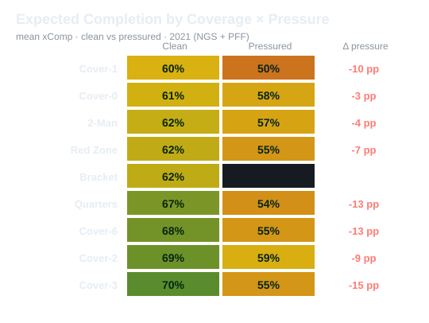

# Expected Completion (xComp) — how coverage and pressure change the odds of a completion

I built **Expected Completion (xComp)**, basically Expected Goals for NFL passing. It is a simple
model that estimates how likely each pass was to be completed based on the coverage, down,
distance, play-action, and whether the quarterback was pressured. Instead of just looking at
whether a pass was caught, it measures **Completion Over Expected (actual minus xComp)** so you can
see which throws beat the odds and how much each coverage, especially under pressure, drags
completion down (across the league, expected completion drops from about 66% clean to 54% under
pressure, and man coverage is the toughest to throw against). I built it for coaches, scouts, and
broadcasters: a defensive coordinator can see which coverages limit completions the most, and a
broadcaster can quickly put a play in context, like calling out a 42% throw. It ships as a
self-contained interactive dashboard with a play predictor, and the model is checked on held-out
games and later weeks so you can trust the numbers.



*(Static preview; open `index.html` for the interactive Play Predictor, play lookup, validation
tables, coverage grid, and calibration plot.)*

> **Retrospective model, not a pre-snap forecast.** One input — whether the defense generated
> pressure — is only known *during or after* the play. xComp therefore describes completion odds
> given the full in-play context (for review/analysis); it is not a real-time pre-snap prediction.

## Interactive tool (`index.html`)

1. **Play Predictor** — select coverage, down, yards-to-go, pressure and play-action; get the
   fitted xComp, the number of training plays behind that estimate, and a flag when the context
   has no training support and falls back to the league mean. Uses the **exact** `fit_scorer()`
   rate table, embedded in the page.
2. **Historical play lookup** — enter `gameId` + `playId` to see the actual result, out-of-fold
   xComp, and COE for that specific pass.
3. **Chronological validation + ablation** tables (see below).
4. **Coverage × pressure grid**, **calibration plot**, and **hardest completions made**.

## Why it's defensible (and what it is not)

- **It beats the naive baseline out-of-fold.** Scored by a model fit on the *other* 4/5 of games,
  xComp improves log-loss from **0.668** (league-rate baseline) to **0.651**, AUC **0.61**.
- **It holds out of time (chronological validation).** Trained on the earlier weeks of 2021 and
  tested on the later weeks (2,622 held-out attempts): log-loss **0.670 → 0.656**, Brier
  **0.239 → 0.232**, AUC **0.60**, calibration error **3.3 pp**. It generalises forward, not just
  across random folds.
- **Its distinctive features earn their place (ablation).** Out-of-fold AUC rises
  **0.53 (situation only) → 0.56 (+coverage) → 0.61 (+pressure)**; pressure is the single biggest
  gain, which is the whole point of the metric.
- **It is calibrated.** Predicted vs observed completion agree to a mean of **3.3 percentage
  points** across deciles — a predicted 60% really completes ~60% of the time.
- **It is interpretable.** The model ranks coverages the way coaches describe them (man tightest,
  zone shells more completable) and quantifies the pressure penalty per coverage.
- **Honest limits:** xComp is for the **play / situation**, not a QB leaderboard — the per-player
  "over expected" residual is not stable in a single 8-game season, so we do not rank passers.
  Pressure is measured on the same play as the throw, so xComp describes completion odds *under*
  those conditions; it is not a causal claim that a coverage caused the outcome.

## How it works

`xComp = P(complete | coverage scheme, down, distance bucket, play-action, pressure)`, estimated as
**shrunk grouped completion rates** (empirical-Bayes toward the league mean so rare situations are
not over-fit), evaluated with **5-fold cross-validation by game** so no play is scored by a model
that saw it. Pressure is a PFF pass-rush label (any hurry, hit, or sack charged on the play).
Pass attempts only (completions, incompletions, interceptions); scrambles are excluded by using
pass-result rows.

## Data

NFL Next Gen Stats + PFF scouting, 2021 (Big Data Bowl). Place the competition CSVs in `data/`
one level up (or set `BDB_DATA_DIR`):

```
data/plays.csv
data/pffScoutingData.csv
data/games.csv            # week numbers, for the chronological validation split
```

Tracking files are **not** needed for this project.

## Reproduce

```bash
pip install -r requirements.txt     # pandas + numpy
python build_xcomp.py               # -> xcomp_outputs.json (model, calibration, grid)
python build_site.py                # -> index.html (self-contained; open in any browser)
python make_preview.py              # -> docs/screenshot.svg (README image)
```

`index.html` embeds its data inline, so it opens by double-clicking — no server, no network.

## Files

| file | purpose |
|---|---|
| `build_xcomp.py` | fits xComp (5-fold OOF + chronological + ablation), `fit_scorer()`, writes outputs |
| `build_site.py` | embeds the JSON into a standalone `index.html` (predictor, lookup, validation, grid) |
| `make_preview.py` | generates `docs/screenshot.svg` |
| `xcomp_outputs.json` | model outputs: metrics, calibration, grid, chrono, ablation, rate table, per-play lookup |
| `xcomp_per_play.csv` | one row per pass attempt: conditions, out-of-fold xComp, COE |
| `index.html` | generated interactive visualisation |

### Scoring any play from Python

```python
from build_xcomp import fit_scorer
score = fit_scorer()
score("Cover-1", down=3, yardsToGo=8, pressure=1)                 # -> 0.430
score("Cover-3", down=1, yardsToGo=10, pressure=0, with_support=True)  # -> (0.722, 415, False)
```

`with_support=True` returns `(xComp, n_training_plays, used_league_mean_fallback)` — the same
support/fallback info the website's Play Predictor shows. Or from the CLI:
`python build_xcomp.py score "Cover-3" 3 7 1 0`.

## License / attribution

Built for the NFL × AWS Big Data Bowl. Underlying data © NFL Next Gen Stats and Pro Football
Focus, used per competition terms.
